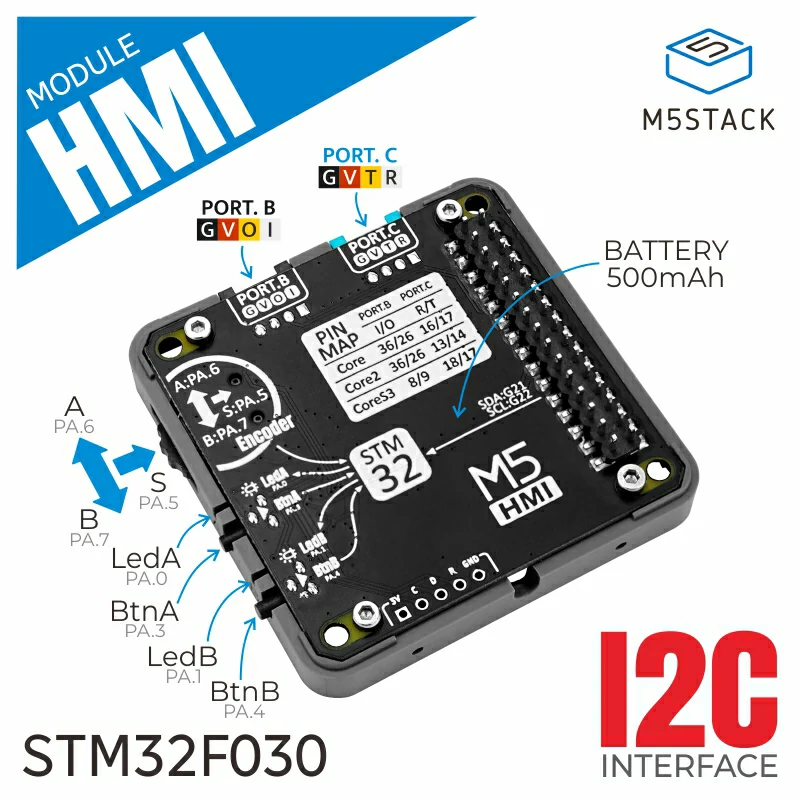

.. _m5stack_module_hmi:

M5Stack Module HMI shield
#########################

Overview
********

`Module HMI`_ is a human–machine interface module for M5Stack boards, featuring
a rotary control, two input buttons, and two LED indicators. It attaches to the
controller through the M-Bus header. The module also provides an additional
PORT.B Grove connector and a PORT.C Grove connector for further expansion, and
includes a built-in 500 mAh lithium battery.

   M5Stack Module HMI shield

Supported Features
==================

This shield brings the following peripherals to the board:

.. list-table::
   :header-rows: 1

   * - Peripheral
     - Kconfig option
     - Devicetree compatible
   * - Input (buttons)
     - :kconfig:option:`CONFIG_INPUT`
     - :dtcompatible:`m5stack,expansion-key-input`
   * - Input (rotary)
     - :kconfig:option:`CONFIG_INPUT`
     - :dtcompatible:`m5stack,expansion-rotary-input`

Requirements
************

This shield can be used with M5Stack boards with M-Bus connector.

Programming
***********

Set ``--shield m5stack_module_hmi`` when you invoke ``west build``.
For example:

.. zephyr-app-commands::
   :zephyr-app: samples/hello_world
   :board: m5stack_cores3/esp32s3/procpu
   :shield: m5stack_module_hmi
   :goals: build

References
**********

.. target-notes::

.. _Module HMI:
   https://docs.m5stack.com/en/module/HMI%20Module
