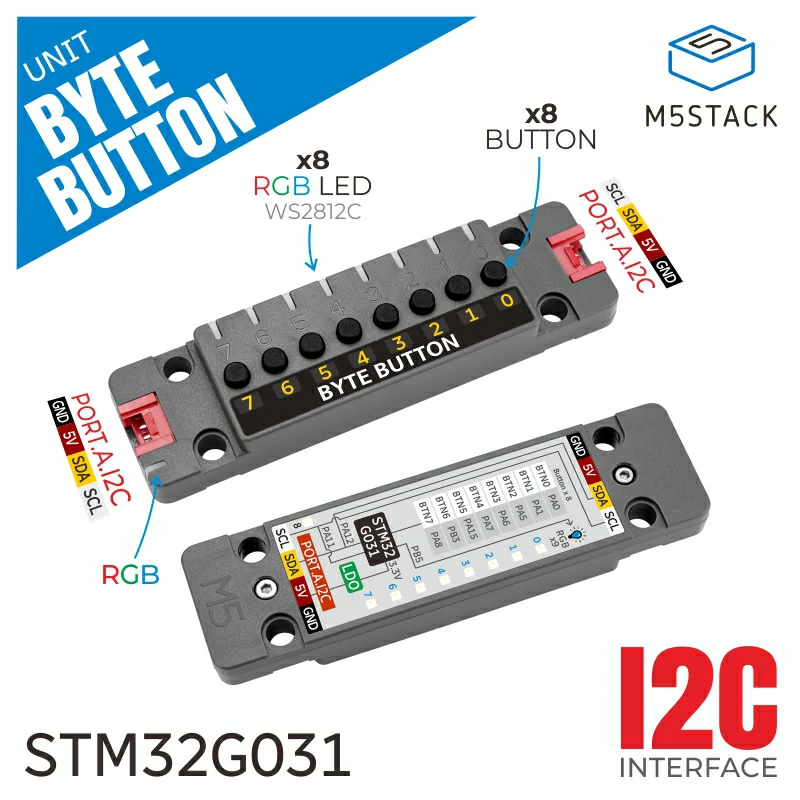

.. _m5stack_unit_bytebutton:

M5Stack Unit ByteButton shield
##############################

Overview
********

`Unit ByteButton`_ is a an 8-channel tactile switch input unit for M5Stack
boards that connects via the PORT.A Grove connector. It provides 8 button inputs
and 9 RGB LEDs.

   M5Stack Unit ByteButton shield

Supported Features
==================

This shield brings the following peripherals to the board:

.. list-table::
   :header-rows: 1

   * - Peripheral
     - Kconfig option
     - Devicetree compatible
   * - Input
     - :kconfig:option:`CONFIG_INPUT`
     - :dtcompatible:`m5stack,unit-bytebutton-input`
   * - LED strip
     - :kconfig:option:`CONFIG_LED_STRIP`
     - :dtcompatible:`m5stack,unit-bytebutton-rgb`

Requirements
************

This shield can be used with M5Stack boards with PORT.A Grove connector.

Programming
***********

Set ``--shield m5stack_unit_bytebutton`` when you invoke ``west build``.
For example:

.. zephyr-app-commands::
   :zephyr-app: samples/hello_world
   :board: m5stack_cores3/esp32s3/procpu
   :shield: m5stack_unit_bytebutton
   :goals: build

References
**********

.. target-notes::

.. _Unit ByteButton:
   https://docs.m5stack.com/en/unit/Unit%20ByteButton
