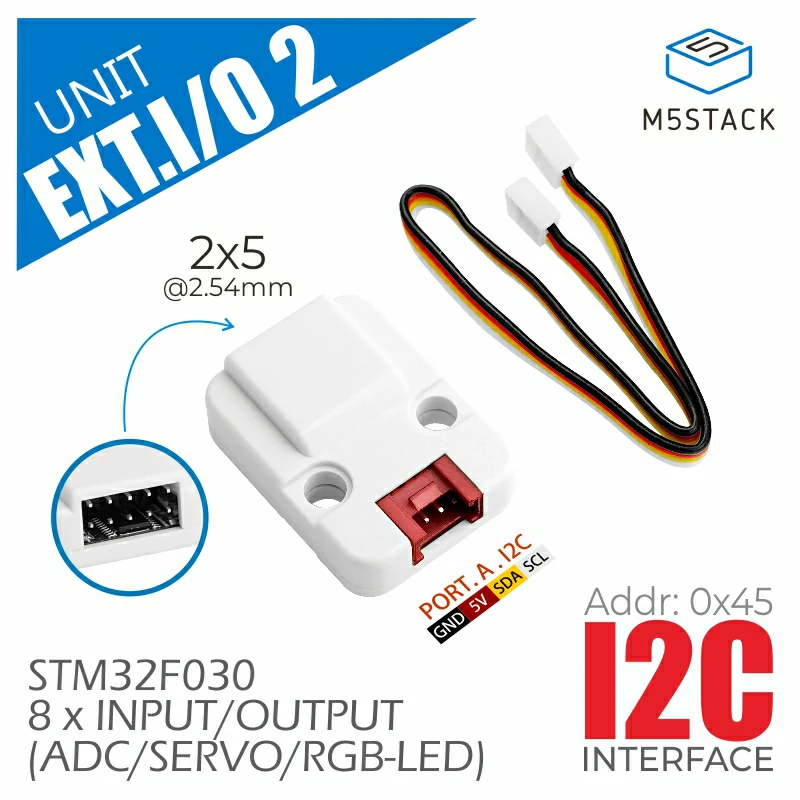

.. _m5stack_unit_extio2:

M5Stack Unit EXT.IO2 shield
###########################

Overview
********

`Unit EXT.IO2`_ is a multifunction I/O expander for M5Stack boards that connects
via the PORT.A Grove connector. It provides additional digital I/Os, analog
inputs, servo controls, RGB LED control, and PWM outputs.

   M5Stack Unit EXT.IO2 shield

Supported Features
==================

This shield brings the following peripherals to the board:

.. list-table::
   :header-rows: 1

   * - Peripheral
     - Kconfig option
     - Devicetree compatible
   * - GPIO
     - :kconfig:option:`CONFIG_GPIO`
     - :dtcompatible:`m5stack,unit-extio2-gpio`

Requirements
************

This shield can be used with M5Stack boards with PORT.A Grove connector.

Programming
***********

Set ``--shield m5stack_unit_extio2`` when you invoke ``west build``.
For example:

.. zephyr-app-commands::
   :zephyr-app: samples/hello_world
   :board: m5stack_cores3/esp32s3/procpu
   :shield: m5stack_unit_extio2
   :goals: build

References
**********

.. target-notes::

.. _Unit EXT.IO2:
   https://docs.m5stack.com/en/unit/extio2
